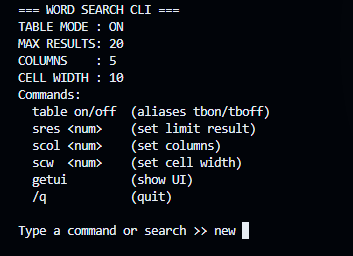
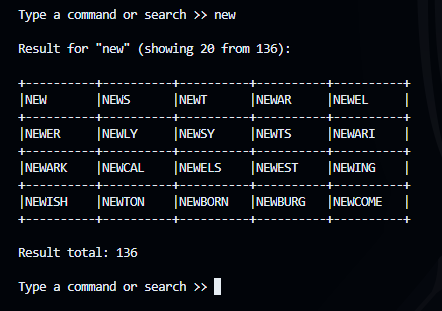

```
 __       __   ______   _______   _______         __    __  __    __  __    __  ________  ______  
/  |  _  /  | /      \ /       \ /       \       /  |  /  |/  |  /  |/  \  /  |/        |/      \ 
$$ | / \ $$ |/$$$$$$  |$$$$$$$  |$$$$$$$  |      $$ |  $$ |$$ |  $$ |$$  \ $$ |$$$$$$$$//$$$$$$  |
$$ |/$  \$$ |$$ |  $$ |$$ |__$$ |$$ |  $$ |      $$ |__$$ |$$ |  $$ |$$$  \$$ |   $$ |  $$ \__$$/ 
$$ /$$$  $$ |$$ |  $$ |$$    $$< $$ |  $$ |      $$    $$ |$$ |  $$ |$$$$  $$ |   $$ |  $$      \ 
$$ $$/$$ $$ |$$ |  $$ |$$$$$$$  |$$ |  $$ |      $$$$$$$$ |$$ |  $$ |$$ $$ $$ |   $$ |   $$$$$$  |
$$$$/  $$$$ |$$ \__$$ |$$ |  $$ |$$ |__$$ |      $$ |  $$ |$$ \__$$ |$$ |$$$$ |   $$ |  /  \__$$ |
$$$/    $$$ |$$    $$/ $$ |  $$ |$$    $$/       $$ |  $$ |$$    $$/ $$ | $$$ |   $$ |  $$    $$/ 
$$/      $$/  $$$$$$/  $$/   $$/ $$$$$$$/        $$/   $$/  $$$$$$/  $$/   $$/    $$/    $$$$$$/                                                                                               
```

A fast and customizable command-line tool for searching English words by prefix.  
Built for games like **Last Letter**, word puzzles, linguistics tools, and general word lookup.

This CLI loads a local `words_dictionary.json` (400k+ words) and performs instant prefix searches using an optimized binary-search algorithm.

---

## ✨ Features

- 🚀 **Instant prefix search** (optimized binary-search, extremely fast)
- 📚 Uses local `words_dictionary.json` — works fully **offline**
- 🎛️ Customizable output
  - Table mode ON/OFF
  - Max result limit
  - Number of columns
  - Column width
- 🔧 Persistent settings via `config.json`
- 📐 Automatic terminal-width adaptation
- ✂️ Clean truncation for long words
- 🎮 Perfect for word-based games or productivity tools

---

## 📦 Installation

Clone the repository:

```sh
git clone https://github.com/jimbonlemu/word-hints-cli
```
Install dependencies:
```
npm install
```
Run:
```
npm start
```  
or with nodemon:
```
npm run dev
```  
---

## 🧠 How It Works

The CLI performs the following steps:

 - Pre-sorts all words (case-insensitive)

 - Finds the lower-bound match using binary search

 - Collects all sequential matching prefixes

 - Renders the output in table mode or plain mode

 - Fits columns automatically to terminal width

 - Truncates long words for clean alignment

---
## 🖥️ Usage
After running the CLI, type any prefix:



Example output:



---

## 🖥️ Commands

| Command          | Description              |
| ---------------- | ------------------------ |
| `table on`       | Enable table mode        |
| `table off`      | Disable table mode       |
| `tbon` / `tboff` | Aliases for table on/off |
| `sres <num>`     | Set result limit         |
| `scol <num>`     | Set number of columns    |
| `scw <num>`      | Set cell width           |
| `getui`          | Show UI header           |
| `/q`             | Quit the program         |

---

## 📚 Dictionary Source
This CLI uses the `words_dictionary.json` file from  
https://github.com/dwyl/english-words  
All credit for the dictionary data belongs to the original authors.

---

## 📜 License

MIT — free to use, modify, and distribute.

---

## 🙏 Acknowledgements

The dictionary data (`words_dictionary.json`) is sourced from the  
**dwyl/english-words** project (MIT License):  
https://github.com/dwyl/english-words

Huge thanks to them for providing a high-quality open word list.

---

## 🙏 Credits

This project includes dictionary data from:

**dwyl/english-words**  
Licensed under the MIT License.  
Copyright © dwyl

Repository: https://github.com/dwyl/english-words

---
## 👤 Author

Made by Mochamad Iqbal Maulana

I made it because I needed it and for fun. Maybe you need it too.

A simple & fast CLI to dominate any word-based challenge.

